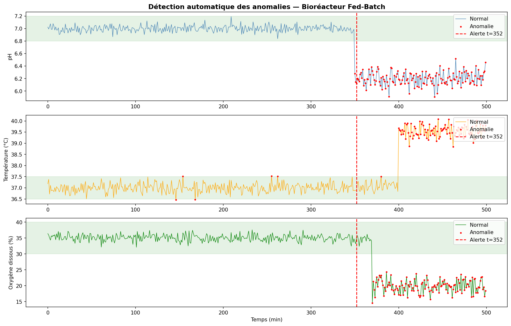

# Bioreactor Anomaly Detection
 
> Monitoring a fed-batch bioprocess in real time — detecting drifts before they become failures.
 
---
 
## Why this project?
 
In bioproduction, a single undetected anomaly can compromise an entire batch representing days of work and significant financial loss. Operators rely on continuous sensor data to track process health, but manually monitoring hundreds of data points is both time-consuming and error-prone.
 
This project explores how data analysis and simple signal processing techniques can automate that monitoring, flagging deviations early and generating actionable diagnostic reports.
 
---
 
## What it does
 
Starting from simulated sensor data representing a typical fed-batch bioreactor, the notebook:
 
- Generates realistic process signals with natural sensor noise (pH, temperature, dissolved oxygen)
- Injects real-world anomaly scenarios at a known time point — contamination, overheating, oxygen depletion
- Detects anomalies using threshold-based classification on raw signals
- Reduces false positives through rolling mean smoothing (window = 10 points)
- Produces an automatic crisis report identifying which parameters failed and their probable cause
---
 
## Key results
 
| Method | First anomaly detected |
|---|---|
| Raw signal (threshold) | t = 146 min false positive |
| Smoothed signal (rolling mean) | t = 352 min accurate |
 
The smoothing step proved critical — reducing noise-induced false alarms while preserving sensitivity to genuine drifts.
 
---
 
## Sample output
 

 
*Three sensor signals monitored over 500 minutes. Red dots = detected anomalies. Red dashed line = automatic alert trigger.*
 
---
 
## Tech stack
 
| Tool | Usage |
|---|---|
| Python 3 | Core language |
| Pandas | Data manipulation |
| NumPy | Signal simulation |
| Matplotlib | Visualization |
 
---
 
## Project structure
 
```
bioprocess-anomaly-detection/
│
├── Bioprocess_Anomaly_Detection.ipynb   # Main notebook
└── README.md
```
 
---
 
## Scientific background
 
Simulated data was generated based on standard operating parameters for mammalian cell culture in fed-batch mode, as described in the bioprocess engineering literature:
 
- **pH** : 7.0 ± 0.05 (normal range: 6.8 – 7.2)
- **Temperature** : 37.0 ± 0.2 °C (normal range: 36.5 – 37.5 °C)
- **Dissolved oxygen** : 35.0 ± 1.0 % (normal range: 30 – 40 %)
Anomalies were designed to simulate plausible process failures encountered in industrial bioproduction environments.
 
---
 
## About
 
Built as a first personal data science project alongside a bioproduction engineering program.  
The goal was to bridge domain knowledge in bioprocesses with practical data analysis skills.
 
**Lucas Lacombe** — Pharmacy student  
